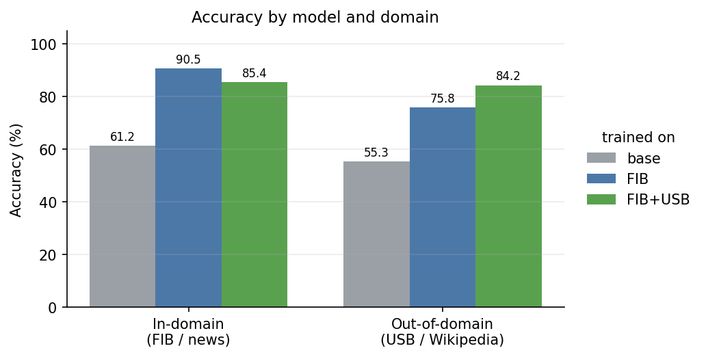

# Fine-Tuned Mistral-7B LLM-as-Judge for Hallucination Detection

A single cost-efficient model that flags hallucinated summaries against their source documents—replacing a larger frontier model used as an LLM judge.

Fine-tuned with **QLoRA** on **Mistral-7B open weights**, built as a fully local, reproducible pipeline (PyTorch / Hugging Face / PEFT / TRL), with an honest held-out evaluation and a serving benchmark.

The model is first trained on the **Factual Inconsistency Benchmark (FIB)** to learn factual consistency by detecting inconsistencies between a document and its summary, then further trained on a mix with the **USB Wikipedia summaries dataset** to improve cross-domain generalization.

---

## Headline results

**Held-out FIB test (in-domain, news):**

| model | accuracy | F1 | precision | recall |
|-------|----------|------|-----------|--------|
| base Mistral-7B-Instruct | 61.2% | 0.72 | 0.56 | 0.99 |
| **fine-tuned (FIB)** | **90.5%** | **0.90** | 0.94 | 0.87 |

The base model's 0.56/0.99 precision/recall shows it almost-*always* predicts
"consistent" — it barely discriminates, and its 61% accuracy is close to chance.
Fine-tuning teaches it to actually judge (balanced 0.94/0.87).

**Cross-domain generalization**: a second model trained on FIB + USB (Wikipedia)
nearly closes the domain gap:

| model | FIB test (in-domain) | USB test (out-of-domain) |
|-------|----------------------|--------------------------|
| base | 61.2% / 0.72 | 55.3% / 0.68 |
| fine-tuned (FIB only) | **90.5% / 0.90** | 75.8% / 0.73 |
| fine-tuned (FIB + USB) | 85.4% / 0.86 | **84.2% / 0.83** |

<br>

<br>

**Training first on FIB and then on FIB+USB trades ~5 points of in-domain performance for +8 points out-of-domain — a balanced 85/84 judge instead of a 90/76 specialist**. 
Which to ship depends on the deployment distribution; having both numbers makes that a
data-driven call.

---

## What this is

A binary factual-consistency judge that predicts whether every claim in a summary is supported by its source document.
The output is strict JSON — `{"consistency": 1}` (consistent) or `{"consistency": 0}`
(inconsistent) — so results are exactly scorable (F1), no LLM-judge rubric needed.

Built deliberately on a **local TRL + PEFT stack** rather than a managed
fine-tuning API, to own the full pipeline: quantization, LoRA config, the training
loop, checkpointing, adapter merge, and serving.

## Pipeline (reproducible scripts, not a notebook)

| stage | script |
|-------|--------|
| data prep — unpack FIB, chat-template + loss masking, balance, doc-level split | `prepare_fib.py` |
| out-of-domain test set (USB / Wikipedia) | `load_usb.py` |
| USB label-polarity check | `check_usb_labels.py` |
| FIB+USB training mix | `make_fib_usb_mix.py` |
| QLoRA SFT training (overfit-check, dynamic eval cadence, Drive checkpointing) | `train_judge_qlora.py` |
| adapter merge + cold-reload verification | `merge_judge.py` |
| evaluation harness (F1/P/R/acc, per-source) | `eval_judge.py` |
| hyperparameter sweep | `sweep.py` |
| serving benchmark | `benchmark_hf.py` (+ `benchmark_vllm.py`) |

Experiment tracking via **Weights & Biases**.

## Data

- **FIB** ([`r-three/fib`](https://huggingface.co/datasets/r-three/fib), arXiv:2211.08412) — news-domain factual-consistency
  benchmark (XSum + CNN/DM). Paired-choice: Each document is paired with one factually consistent summary and several model-generated inconsistent summaries.
- **USB** ([`kundank/usb`](https://huggingface.co/datasets/kundank/usb), factuality_classification) — Wikipedia-domain dataset used as an out-of-domain test set and, in a second experiment, partially mixed into the training data to improve cross-domain generalization.

Both datasets are unpacked into balanced binary classification examples, formatted with the Mistral chat template, and trained with prompt tokens masked from the loss (-100). Splits are
**document-level** and **class-balanced**; the FIB **test** split is sealed and
touched once for final numbers only.


## Serving

The merged model was benchmarked on a single L4 GPU (bf16) using judge prompts from the FIB test set. Outputs average only ~8 tokens, so inference is dominated by request overhead rather than token generation. As a result, **documents/sec** is the most meaningful throughput metric.

| batch | docs/sec | p50 latency |
| ----- | -------- | ----------- |
| 1     | 1.7      | 603 ms      |
| 8     | **2.9**  | 2659 ms     |
| 16    | 2.8      | 5196 ms     |

Throughput peaks at batch 8 before plateauing, while latency increases with batch size—the classic throughput/latency trade-off.

These benchmarks use standard Hugging Face `generate()` without serving optimizations such as PagedAttention or continuous batching. A dedicated inference runtime (e.g., vLLM or TGI) would be expected to deliver higher throughput in production.


## Engineering notes (the interesting parts)

* **Data-integrity audit:** The supposedly balanced FIB benchmark became 85/15 after unpacking because each reference summary is paired with multiple distractor negatives, and asymmetric deduplication preserved that imbalance. The symptom was an apparent 85% accuracy but F1=0 on higher-rank sweep configurations—a classic majority-class collapse. Rebalancing to one pair per document restored the intended 50/50 distribution.
* **Reading metrics, not just accuracy:** The base model's high-recall/low-precision profile revealed a near-constant classifier that accuracy alone would have hidden.
* **Owning the training loop:** Documented practical lessons from building a local QLoRA pipeline, including precision pitfalls (native bf16 on Ampere vs slow-emulated on T4), mixed-precision failures (fp16 GradScaler with bf16 weights), memory tuning (gradient checkpointing, batch size, accumulation, and choosing `max_len` from the token-length distribution to limit truncation-induced label noise), and the subtle TRL+PEFT double-prepare freeze bug. See `qlora_training_lessons.md`.
* **Honest evaluation:** Sealed test set, document-level splits, per-source reporting (XSum vs. CNN/DM), and a verified-polarity out-of-domain test set.


## Reproduce

```bash
pip install torch transformers peft trl bitsandbytes accelerate datasets wandb

# 1. data
python ./src/prepare_fib.py --max-doc-chars 6000
python ./src/load_usb.py --flip-labels --max-doc-chars 6000    # if load fails, pin datasets<3.0
python ./src/check_usb_labels.py --file ./data/usb_test.jsonl  # polarity guard
python ./src/make_fib_usb_mix.py --flip-labels --max-doc-chars 6000 --usb-cap 2500  # FIB+USB mix

# 2. train — Model A (FIB only) and Model B (FIB+USB), same config, data differs
python ./src/train_judge_qlora.py --run-name fib \
    --train ./data/train.jsonl --eval ./data/val.jsonl \
    --base-model mistralai/Mistral-7B-Instruct-v0.3 --max-len 1024 \
    --output-dir ./ckpt_fib
python ./src/train_judge_qlora.py --run-name fib_usb \
    --train ./data/train_fib_usb.jsonl --eval ./data/val.jsonl \
    --base-model mistralai/Mistral-7B-Instruct-v0.3 --max-len 1024 \
    --output-dir ./ckpt_fib_usb

# 3. merge + verify (repeat per model)
python ./src/merge_judge.py --base-model mistralai/Mistral-7B-Instruct-v0.3 \
    --adapter ./ckpt_fib/final_adapter --merged-dir ./judge_fib
python ./src/merge_judge.py --base-model mistralai/Mistral-7B-Instruct-v0.3 \
    --adapter ./ckpt_fib_usb/final_adapter --merged-dir ./judge_fib_usb

# 4. evaluate each model, in-domain (FIB test) + out-of-domain (USB test)
python ./src/eval_judge.py --model ./judge_fib     --data ./data/test.jsonl
python ./src/eval_judge.py --model ./judge_fib     --data ./data/usb_test.jsonl
python ./src/eval_judge.py --model ./judge_fib_usb --data ./data/test.jsonl
python ./src/eval_judge.py --model ./judge_fib_usb --data ./data/usb_test.jsonl

# 5. serve benchmark
python ./src/benchmark_hf.py --model ./judge_fib_usb --data ./data/test.jsonl
```

Trained on a single 24GB GPU (Colab L4). Base model:
`mistralai/Mistral-7B-Instruct-v0.3`. Convention: `1` = consistent, `0` = inconsistent.

## Limitations

* **Small in-domain test set.** The FIB test set contains only 178 examples, so the overall F1 is reasonably reliable, but per-source results—especially CNN/DM (n=28)—should be interpreted as directional rather than definitive. The USB test set (n=5,464) provides much stronger statistical confidence.
* **Output formatting contributes to the reported gain.** Part of the improvement from the base model comes from reliably producing the required JSON output, whereas the base model does not consistently follow the requested format. This is a genuine part of the deployment improvement and is reported transparently.
* **Limited supervised training data.** The balanced single-pair FIB training set contains only ~836 examples. Mixing in USB was motivated not only by improving cross-domain generalization, but also by increasing the amount and diversity of supervised training data.
